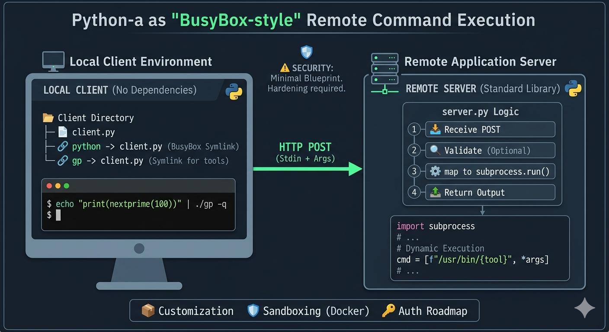

<div align="center">

# 🚀 Remote Exec Server & Client


**Lightweight Python-based remote command execution system**  
*One client script, multiple symlinks, BusyBox-style.*

> ⚠️ **WARNING**  
> This software executes commands received over HTTP.  
> Never expose it directly to the public Internet without authentication, encryption, access controls, and proper isolation.

[Overview](#overview) • [Installation](#installation) • [Usage](#usage) • [Security Considerations](#security-considerations) • [License](#license)

</div>

---

# 📖 Table of Contents

* [Overview](#overview)
* [Features](#features)
* [Architecture](#architecture)
* [Requirements](#requirements)
* [Quick Start](#-quick-start)
* [Installation](#installation)
* [Configuration](#configuration)
* [Usage](#usage)
* [Protocol](#protocol)
* [Examples](#examples)
* [Security Considerations](#security-considerations)
* [Troubleshooting](#troubleshooting)
* [Project Structure](#project-structure)
* [Limitations](#limitations)
* [Future Improvements](#future-improvements)
* [Contributing](#contributing)
* [License](#license)

---

# Overview

Remote Exec Server & Client is a minimal remote command execution framework written entirely with the Python standard library.

The project consists of:

* **server.py** — receives HTTP requests and executes commands locally.
* **client.py** — forwards command invocations and standard input to the server.
* **BusyBox-style symlink support** — one client script can act as many commands depending on the name it is invoked under.

The design is intentionally lightweight, dependency-free, and easy to deploy.

---

## 🌱 Project Inspiration

The idea for **Remote Exec Server & Client** grew out of work on [pari-gp-scripts](https://github.com/Abhrankan-Chakrabarti/pari-gp-scripts), a collection of scripts for the PARI/GP number theory system.  

While developing those scripts, I experimented with:
- **Symlink wrappers** — one script acting as multiple commands, BusyBox‑style.  
- **Lightweight tooling** — keeping dependencies minimal and relying on the standard library.  
- **Command forwarding** — piping input into `gp` and other interpreters for quick execution.  

These patterns sparked the realization that the same approach could be generalized: instead of just wrapping `gp` locally, why not design a framework where one client script can forward commands to a server over HTTP?  

Thus, Remote Exec Server & Client was born — a minimal, dependency‑free system for remote command execution, inspired by the simplicity and flexibility of the PARI/GP scripting workflow.

---

# Features

* HTTP-based command forwarding
* Standard input (stdin) forwarding
* Command-line argument support
* BusyBox-style symlink invocation
* Works with any executable installed on the server
* No third-party dependencies
* Cross-platform Python implementation
* Minimal setup and deployment

---

## Architecture

```text
┌─────────────┐
│   Client    │
│  (symlink)  │
└──────┬──────┘
       │ HTTP POST
       ▼
┌─────────────┐
│   Server    │
│ server.py   │
└──────┬──────┘
       │
       ▼
┌─────────────┐
│ subprocess  │
│ execution   │
└─────────────┘
       │
       ▼
┌─────────────┐
│   Output    │
└─────────────┘
```

### Visual Diagram

[](https://github.com/foxhackerzdevs/remote-exec-server)

---

# Requirements

* Python 3.8+
* Network connectivity between client and server

No external dependencies are required.

---

# ⚡ Quick Start

Start the server:

```bash
python server.py
```

Create a command symlink:

```bash
ln -s client.py gp
```

Execute a remote command:

```bash
echo "print(nextprime(100))" | ./gp -q
```

---

# Installation

## Server Setup

Copy `server.py` to the machine that will execute commands.

Run:

```bash
python server.py
```

Default listening address:

```text
0.0.0.0:8000
```

---

## Client Setup

Edit the server address:

```python
host = "SERVER_IP:8000"
```

Make executable:

```bash
chmod +x client.py
```

Place in your PATH:

```bash
cp client.py ~/bin/
```

Create command aliases:

```bash
ln -s ~/bin/client.py ~/bin/gp
ln -s ~/bin/client.py ~/bin/python
ln -s ~/bin/client.py ~/bin/node
```

Each symlink name becomes the command executed remotely.

---

# Configuration

## Client

Set the server host:

```python
host = "192.168.56.1:8000"
```

To enable HTTPS:

```python
http.client.HTTPSConnection
```

instead of:

```python
http.client.HTTPConnection
```

The server must also be configured for TLS.

---

## Server

Bind only to localhost:

```python
HTTPServer(("127.0.0.1", 8000), MyHandler)
```

Change port:

```python
HTTPServer(("0.0.0.0", 9000), MyHandler)
```

---

# Usage

## Basic Execution

```bash
command_name [arguments]
```

## With Standard Input

```bash
echo "input data" | command_name [arguments]
```

## Using Symlinks

```bash
ln -s client.py python
ln -s client.py node
ln -s client.py gp
```

The invoked name determines the command sent to the server.

---

# Protocol

The communication protocol is intentionally simple.

## Request

```http
POST /python script.py arg1 arg2 HTTP/1.1
Host: server:8000
Content-Type: text/plain
```

Request body:

```text
stdin data goes here
```

---

## Server Processing

```python
cmd_parts = shlex.split(raw_path)
subprocess.run(cmd_parts, input=stdin_data)
```

---

## Response

Success:

```text
stdout output
```

Failure:

```text
Error:
stderr output
```

---

# Examples

## Remote PARI/GP

```bash
echo "print(nextprime(100))" | gp -q
```

## Remote Python

```bash
echo "print('Hello World')" | python
```

## Remote Node.js

```bash
echo "console.log('hello from node')" | node
```

## Pass Arguments

```bash
echo "hello" | python script.py arg1 arg2
```

---

# Security Considerations

This project provides remote command execution capability and should be treated accordingly.

## Risks

* Arbitrary command execution
* Remote code execution (RCE)
* Unauthorized access
* Resource exhaustion
* Data exposure

## Recommended Protections

### Command Whitelisting

```python
ALLOWED = {"python", "gp", "node"}

if cmd_parts[0] not in ALLOWED:
    output = f"Command not allowed: {cmd_parts[0]}"
    return
```

### Network Restrictions

* VPN access only
* SSH tunnels
* Firewall allowlists
* Private networks

### Authentication

Implement one or more of:

* API keys
* Bearer tokens
* Mutual TLS
* Basic authentication

### Isolation

Run commands:

* Inside Docker containers
* Inside restricted user accounts
* Inside sandboxes

### Encryption

Use HTTPS/TLS whenever traffic crosses untrusted networks.

---

# Troubleshooting

## Connection Refused

Verify:

```bash
python server.py
```

Check:

* Server is running
* Correct IP address
* Correct port
* Firewall configuration

---

## Command Not Found

Verify the executable exists:

```bash
which python
which node
which gp
```

---

## Empty Output

Check:

* Server logs
* Command stdout/stderr behavior
* Input handling

---

## Wrong Host

Verify:

```python
host = "SERVER_IP:8000"
```

---

# Project Structure

```text
.
├── client.py
├── server.py
├── README.md
├── LICENSE
├── CONTRIBUTING.md
└── docs/
    └── diagram.png
```

---

# Limitations

Current implementation intentionally remains minimal.

* No authentication
* No TLS support by default
* No output streaming
* No concurrency
* No request validation
* No rate limiting
* No audit logging
* No file transfer support

---

# Future Improvements

* HTTPS/TLS support
* API-key authentication
* Mutual TLS
* Built-in command whitelists
* Output streaming
* Async request handling
* Docker deployment
* Audit logging
* Request signing
* Rate limiting
* File upload/download support

---

# Contributing

Contributions are welcome.

Potential contribution areas:

* Security enhancements
* Protocol improvements
* Testing
* Documentation
* Containerization
* Performance optimization

Feel free to open issues, submit pull requests, or fork the project.

See [CONTRIBUTING.md](./CONTRIBUTING.md) for guidelines on documentation, security, development, and the contribution flow.

---

# License

SPDX-License-Identifier: MIT

This project is licensed under the MIT License — see the repository LICENSE file for the full text:

[LICENSE](./LICENSE)

---

## 🔗 See also

- [PARI/GP Scripts](https://github.com/Abhrankan-Chakrabarti/pari-gp-scripts) —  
  A collection of Bash wrappers for PARI/GP number theory experiments that inspired the design of this project.


